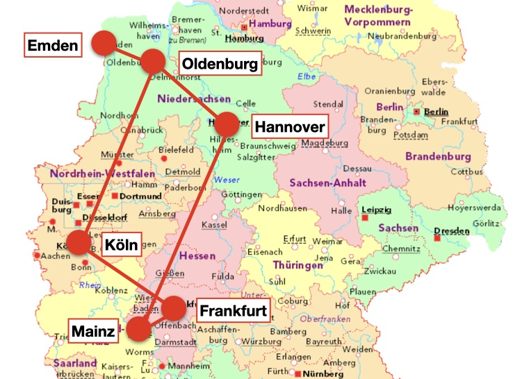

# Beispiel 2: Ablaufsteuerung mit einer Zählvariable in der `while`-Schleife

## Worum geht es?
Dieses Beispiel zeigt, wie Zählvariablen dazu benutzt werden können, die Schleifenausführung zu steuern. 

Die aus dem Hauptprogramm `main.cpp` ggf. bereits bekannte Routenplanung zwischen zwei Städten wird wie in [Beispiel 1](https://go.tfe.academy/2008273) so erweitert, dass die kürzeste Route zwischen *mehreren* Städten in einer Liste und einer gemeinsamen Zielstadt (Mainz) berechnet wird. 

Der Unterschied besteht darin, dass die Städte in der Liste nicht mehr gelöscht, sondern über eine Zählvariable ausgelesen werden. Die Schleife wird beendet, sobald die Zählvariable identisch zur Listengröße ist. 

Beim Hochzählen besteht hier die Möglichkeit, über ein verändertes Inkrement (z.B. `+2` statt `+1`) die Schleifenausführung zu steuern.

**Hinweis**: Unter [go.tfe.academy/2008271](https://go.tfe.academy/2008271) findest du das zugehörige Video sowie ein Begleit-PDF zur while-Schleife, in dem u.a. dieses Beispiel detailliert beschrieben wird.

 

## Welche Dateien und Ordner sind wichtig?
- `examples/exa_02/README.md` : Diese Datei. Enthält die Aufgabenbeschreibung und weitere wichtige Infos

- `examples/exa_02/main.cpp` : Enthält die `main`-Funktion zu diesem Beispiel

- `README.md` : Enthält die Projektbeschreibung und eine Anleitung, wie sich dieses Beispiel lokal kompilieren und ausführen lässt (*Variante B*).

- `citymap.txt`: Enthält die Datenbasis für die Suche mit derzeit 6 Städte und 6 Straßen.

  

 

## Wie kann ich den Code im Projekt nutzen?

###  **Variante A (empfohlen)** : Online-Enwicklungsumgebung repl.it

Der einfachste Weg, den Code auszuführen und zu verändern, ist über die Online-IDE `repl.it`. 

Über den folgenden Link kommst du direkt zum Editor und über den `Run`-Button kann dieses Beispiel kompiliert und ausgeführt werden: --> [go.tfe.academy/2008274](https://go.tfe.academy/2008274)

  

###  **Variante B** : Das Projekt auf der eigenen Festplatte starten

Es besteht natürlich auch die Möglichkeit, das Projekt in einem lokalen Verzeichnis von GitHub zu klonen oder als zip-Datei herunterzuladen. Eine detaillierte Beschreibung ist hier zu finden --> [`README.md`](./../../README.md#)

 

## Wie geht es nach diesem Beispiel weiter? 

Wenn du mit diesem Beispiel fertig bist, kannst du z.B. hier weitermachen: 

1. **Beispiel 1** (`examples/exa_01/main.cpp`) : Routenplanung zwischen mehreren Städten mit einer `while`-Schleife --> [go.tfe.academy/2008273](https://go.tfe.academy/2008273)

2. **Übung 1** (`exercises/exe_01/main.cpp`) : Ausgabe aller Städte mit einer `while`-Schleife --> [go.tfe.academy/2008275](https://go.tfe.academy/2008275)
   
3. **Übung 2** (`exercises/exe_02/main.cpp`) : Kombination aller Städte mit verschachtelten `while`-Schleifen --> [go.tfe.academy/2008276](https://go.tfe.academy/2008276)

Wenn du Lust auf ein anderes Thema zu C++ hast, dann schau gerne hier nach --> [go.tfe.academy/2008271](https://go.tfe.academy/2008271) 

  
Copyright 2020, Dr. Andreas Haja
 
www.thefearlessengineer.com